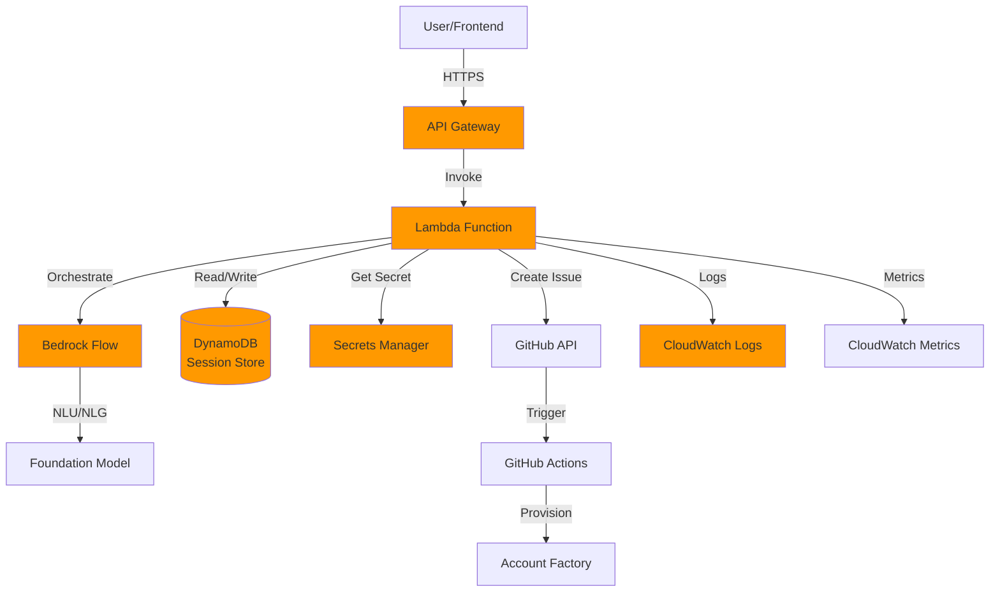
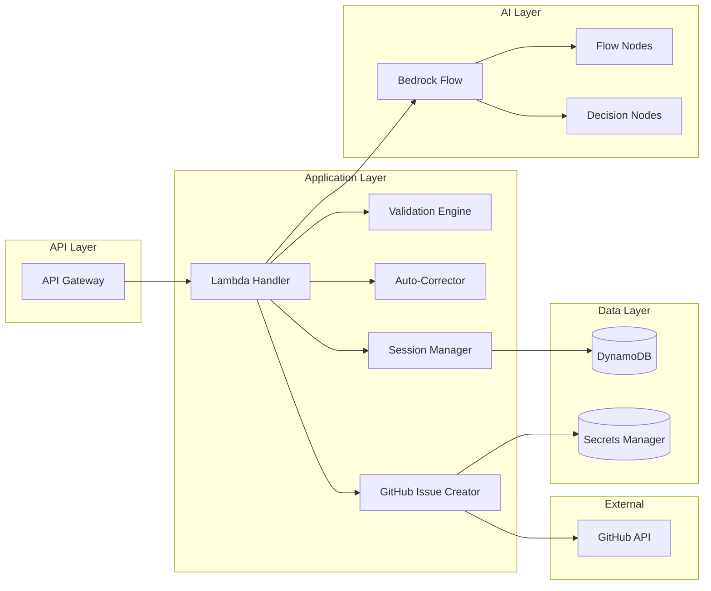
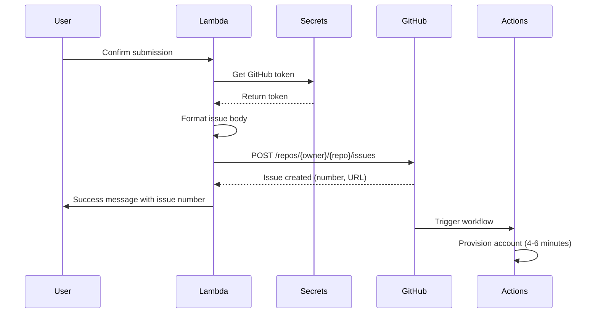

# Design Document: Bedrock Conversational Intake

## Overview

The Bedrock Conversational Intake system is a serverless conversational AI application that enables hospital teams to request AWS accounts through natural language interaction. The system replaces manual form-filling with an intelligent chatbot that guides users through a 10-question intake process, validates responses in real-time, auto-corrects common formatting issues, and automatically creates GitHub Issues that trigger the existing Account Factory provisioning workflow.

### Key Design Principles

1. **Zero Breaking Changes**: The system integrates with existing infrastructure without modifying the Account Factory, GitHub Actions workflows, or provisioning logic
2. **Serverless Architecture**: Leverages AWS managed services (Lambda, API Gateway, Bedrock Flow, DynamoDB) for automatic scaling and minimal operational overhead
3. **Conversation-First Design**: Prioritizes natural language interaction over structured forms
4. **Real-Time Validation**: Provides immediate feedback and auto-correction during the conversation
5. **Stateful Sessions**: Maintains conversation context across multiple interactions with timeout and resumption capabilities
6. **Security by Design**: Implements authentication, authorization, and secrets management from the ground up

### System Boundaries

**In Scope:**
- Conversational AI interface for account intake
- Real-time validation and auto-correction of user responses
- Session state management with persistence
- GitHub Issue creation in existing template format
- User authentication and authorization
- Logging, monitoring, and error handling

**Out of Scope:**
- Account Factory provisioning logic (existing system)
- GitHub Actions workflow modifications (existing system)
- AWS account creation process (existing system)
- User interface beyond API endpoints (frontend implementation separate)

## Architecture

### High-Level Architecture

The system follows a serverless event-driven architecture with the following major components:



### Component Architecture



### AWS Services Architecture

#### API Gateway Configuration

- **Type**: REST API (regional)
- **Authentication**: AWS IAM or Amazon Cognito User Pools
- **Endpoints**:
  - `POST /conversation/start` - Initialize new conversation session
  - `POST /conversation/message` - Send user message and receive response
  - `GET /conversation/status` - Check conversation session status
  - `POST /conversation/resume` - Resume timed-out conversation
  - `DELETE /conversation/end` - Explicitly end conversation session

- **Request/Response Format**: JSON
- **CORS**: Enabled for frontend integration
- **Throttling**: 100 requests per second per user
- **API Keys**: Not required (using IAM/Cognito)

#### Lambda Function Design

**Function Name**: `bedrock-intake-handler`

**Runtime**: Python 3.11

**Memory**: 512 MB

**Timeout**: 30 seconds

**Environment Variables**:
- `DYNAMODB_TABLE_NAME`: Session state table name
- `GITHUB_SECRET_ARN`: ARN of GitHub token in Secrets Manager
- `GITHUB_REPO_OWNER`: GitHub organization/owner name
- `GITHUB_REPO_NAME`: Account Factory repository name
- `BEDROCK_FLOW_ID`: Bedrock Flow identifier
- `BEDROCK_FLOW_ALIAS`: Bedrock Flow alias (e.g., "PROD")
- `SESSION_TIMEOUT_MINUTES`: Inactivity timeout (default: 20)
- `SESSION_WARNING_MINUTES`: Inactivity warning (default: 15)

**IAM Permissions**:
- `bedrock:InvokeFlow` - Invoke Bedrock Flow
- `dynamodb:GetItem`, `dynamodb:PutItem`, `dynamodb:UpdateItem`, `dynamodb:DeleteItem` - Session management
- `secretsmanager:GetSecretValue` - Retrieve GitHub token
- `logs:CreateLogGroup`, `logs:CreateLogStream`, `logs:PutLogEvents` - CloudWatch logging
- `cloudwatch:PutMetricData` - CloudWatch metrics

#### DynamoDB Table Design

**Table Name**: `bedrock-intake-sessions`

**Primary Key**:
- Partition Key: `session_id` (String) - UUID v4

**Attributes**:
- `session_id` (String) - Unique session identifier
- `user_id` (String) - Authenticated user identifier
- `created_at` (Number) - Unix timestamp of session creation
- `last_activity` (Number) - Unix timestamp of last user interaction
- `current_question` (Number) - Index of current question (0-9)
- `responses` (Map) - User responses keyed by question identifier
- `conversation_state` (String) - Current state: ACTIVE, WAITING_CONFIRMATION, COMPLETED, TIMED_OUT
- `retry_counts` (Map) - Validation retry attempts per question
- `ttl` (Number) - DynamoDB TTL attribute (24 hours from creation)

**Indexes**: None required (single-item access pattern)

**Capacity Mode**: On-demand (pay-per-request)

**TTL**: Enabled on `ttl` attribute (automatic cleanup after 24 hours)

**Point-in-Time Recovery**: Enabled

**Encryption**: AWS managed keys (SSE)

#### Secrets Manager Configuration

**Secret Name**: `bedrock-intake/github-token`

**Secret Type**: Other type of secret

**Secret Value** (JSON):
```json
{
  "github_token": "ghp_xxxxxxxxxxxxxxxxxxxx",
  "github_api_url": "https://api.github.com"
}
```

**Rotation**: Manual (GitHub Personal Access Token or GitHub App)

**Required GitHub Token Permissions**:
- `repo` scope (full control of private repositories)
- Specifically: `repo:status`, `repo_deployment`, `public_repo`, `repo:invite`

#### Bedrock Flow Architecture

**Flow Name**: `account-intake-flow`

**Foundation Model**: Amazon Titan Text Premier or Anthropic Claude 3 Sonnet

**Flow Structure**: Sequential question flow with validation branches


**Flow Nodes**:

1. **Start Node**: Initialize conversation, greet user
2. **Question Nodes (Q1-Q10)**: Present each intake question
3. **Validation Nodes (V1-V10)**: Validate user responses
4. **Correction Nodes (C1-C10)**: Apply auto-corrections
5. **Confirmation Node**: Present summary for user approval
6. **Submission Node**: Create GitHub Issue
7. **Success Node**: Confirm successful submission
8. **Error Node**: Handle errors and offer retry
9. **Help Node**: Provide contextual help
10. **Exit Node**: Handle conversation termination

**Flow Transitions**:
- Start → Q1
- Qn → Vn (validate response)
- Vn → Cn (if correction needed) → Qn (show correction) → Q(n+1) (if accepted)
- Vn → Qn (if invalid, retry) → Vn (max 3 retries)
- Vn → Q(n+1) (if valid)
- Q10 → Confirmation
- Confirmation → Submission (if approved)
- Confirmation → Qn (if user wants to modify specific answer)
- Submission → Success (if GitHub Issue created)
- Submission → Error (if creation fails, max 3 retries)

**State Management**:
- Bedrock Flow maintains internal conversation state
- Lambda function persists state to DynamoDB after each interaction
- Session state includes: current node, all responses, retry counts, timestamps


## Components and Interfaces

### Lambda Handler Component

**Responsibility**: Orchestrate conversation flow, manage sessions, coordinate validation and GitHub integration

**Interface**:

```python
class IntakeHandler:
    def handle_start_conversation(self, user_id: str, auth_context: dict) -> dict:
        """Initialize new conversation session"""
        
    def handle_message(self, session_id: str, user_message: str) -> dict:
        """Process user message and return chatbot response"""
        
    def handle_resume(self, session_id: str, user_id: str) -> dict:
        """Resume timed-out conversation session"""
        
    def handle_end_conversation(self, session_id: str) -> dict:
        """Explicitly end conversation session"""
```

**Response Format**:
```json
{
  "session_id": "uuid-v4",
  "message": "Chatbot response text",
  "question_number": 1,
  "total_questions": 10,
  "state": "ACTIVE",
  "requires_confirmation": false,
  "metadata": {
    "correction_applied": false,
    "original_value": null,
    "corrected_value": null
  }
}
```

### Validation Engine Component

**Responsibility**: Validate user responses against defined rules for each question

**Interface**:

```python
class ValidationEngine:
    def validate_team_name(self, value: str) -> ValidationResult:
        """Validate team name format"""
        
    def validate_team_lead(self, value: str) -> ValidationResult:
        """Validate team lead name"""
        
    def validate_email(self, value: str) -> ValidationResult:
        """Validate email address"""
        
    def validate_cost_center(self, value: str) -> ValidationResult:
        """Validate cost center format"""
        
    def validate_data_classification(self, value: str) -> ValidationResult:
        """Validate data classification selection"""
        
    def validate_business_criticality(self, value: str) -> ValidationResult:
        """Validate business criticality selection"""
        
    def validate_use_case(self, value: str) -> ValidationResult:
        """Validate primary use case"""
        
    def validate_budget(self, value: str) -> ValidationResult:
        """Validate budget amount"""
        
    def validate_aws_services(self, value: str) -> ValidationResult:
        """Validate AWS services list"""
        
    def validate_compliance(self, value: str) -> ValidationResult:
        """Validate compliance requirements"""
```

**ValidationResult Structure**:
```python
@dataclass
class ValidationResult:
    is_valid: bool
    error_message: Optional[str]
    example: Optional[str]
    field_name: str
```


### Auto-Corrector Component

**Responsibility**: Automatically correct common formatting issues in user responses

**Interface**:

```python
class AutoCorrector:
    def correct_team_name(self, value: str) -> CorrectionResult:
        """Convert to lowercase, validate characters"""
        
    def correct_email(self, value: str) -> CorrectionResult:
        """Convert to lowercase"""
        
    def correct_cost_center(self, value: str) -> CorrectionResult:
        """Uppercase CC prefix and department"""
        
    def correct_data_classification(self, value: str) -> CorrectionResult:
        """Convert to lowercase"""
        
    def correct_business_criticality(self, value: str) -> CorrectionResult:
        """Convert to lowercase"""
        
    def correct_use_case(self, value: str) -> CorrectionResult:
        """Convert to lowercase, replace spaces with hyphens"""
        
    def correct_budget(self, value: str) -> CorrectionResult:
        """Parse shorthand notation (5k -> 5000), remove currency symbols"""
        
    def correct_aws_services(self, value: str) -> CorrectionResult:
        """Map natural language to standard service names"""
        
    def correct_compliance(self, value: str) -> CorrectionResult:
        """Uppercase acronyms, standardize format"""
```

**CorrectionResult Structure**:
```python
@dataclass
class CorrectionResult:
    was_corrected: bool
    original_value: str
    corrected_value: str
    correction_description: str
```

### Session Manager Component

**Responsibility**: Manage conversation session lifecycle and persistence

**Interface**:

```python
class SessionManager:
    def create_session(self, user_id: str) -> Session:
        """Create new conversation session"""
        
    def get_session(self, session_id: str) -> Optional[Session]:
        """Retrieve existing session"""
        
    def update_session(self, session: Session) -> None:
        """Persist session state changes"""
        
    def check_timeout(self, session: Session) -> TimeoutStatus:
        """Check if session has timed out"""
        
    def delete_session(self, session_id: str) -> None:
        """Delete session (explicit end or after TTL)"""
```

**Session Structure**:
```python
@dataclass
class Session:
    session_id: str
    user_id: str
    created_at: int
    last_activity: int
    current_question: int
    responses: Dict[str, str]
    conversation_state: str
    retry_counts: Dict[str, int]
    ttl: int
```


### GitHub Issue Creator Component

**Responsibility**: Create GitHub Issues in the exact format expected by Account Factory

**Interface**:

```python
class GitHubIssueCreator:
    def create_issue(self, responses: Dict[str, str], user_id: str) -> IssueCreationResult:
        """Create GitHub Issue from conversation responses"""
        
    def format_issue_body(self, responses: Dict[str, str]) -> str:
        """Format responses into GitHub Issue template"""
        
    def get_github_client(self) -> Github:
        """Get authenticated GitHub API client"""
```

**IssueCreationResult Structure**:
```python
@dataclass
class IssueCreationResult:
    success: bool
    issue_number: Optional[int]
    issue_url: Optional[str]
    error_message: Optional[str]
```

**GitHub Issue Template Format**:

The system must create issues matching this exact format:

```markdown
## Account Request

**Team Name:** {team_name}
**Team Lead:** {team_lead_name}
**Team Email:** {team_email}
**Cost Center:** {cost_center}

## Configuration

**Data Classification:** {data_classification}
**Business Criticality:** {business_criticality}
**Primary Use Case:** {primary_use_case}
**Estimated Monthly Budget:** ${budget}

## Additional Requirements

**Additional AWS Services:** {aws_services}
**Compliance Requirements:** {compliance_requirements}

---
*This issue was created by the Bedrock Conversational Intake system*
*Requested by: {user_id}*
*Request timestamp: {timestamp}*
```

**GitHub API Integration**:
- Library: PyGithub (Python GitHub API wrapper)
- Authentication: Personal Access Token or GitHub App
- API Endpoint: `POST /repos/{owner}/{repo}/issues`
- Required Fields: title, body, labels
- Issue Title Format: `Account Request: {team_name}`
- Labels: `["account-request"]`


## Data Models

### Session State Model

```python
from dataclasses import dataclass, field
from typing import Dict, Optional
from enum import Enum

class ConversationState(Enum):
    ACTIVE = "ACTIVE"
    WAITING_CONFIRMATION = "WAITING_CONFIRMATION"
    COMPLETED = "COMPLETED"
    TIMED_OUT = "TIMED_OUT"
    CANCELLED = "CANCELLED"

@dataclass
class SessionState:
    session_id: str
    user_id: str
    created_at: int  # Unix timestamp
    last_activity: int  # Unix timestamp
    current_question: int  # 0-9 for questions, 10 for confirmation
    responses: Dict[str, str] = field(default_factory=dict)
    conversation_state: ConversationState = ConversationState.ACTIVE
    retry_counts: Dict[str, int] = field(default_factory=dict)
    ttl: int = 0  # Unix timestamp for DynamoDB TTL
    
    def to_dynamodb_item(self) -> dict:
        """Convert to DynamoDB item format"""
        return {
            'session_id': self.session_id,
            'user_id': self.user_id,
            'created_at': self.created_at,
            'last_activity': self.last_activity,
            'current_question': self.current_question,
            'responses': self.responses,
            'conversation_state': self.conversation_state.value,
            'retry_counts': self.retry_counts,
            'ttl': self.ttl
        }
    
    @classmethod
    def from_dynamodb_item(cls, item: dict) -> 'SessionState':
        """Create from DynamoDB item"""
        return cls(
            session_id=item['session_id'],
            user_id=item['user_id'],
            created_at=item['created_at'],
            last_activity=item['last_activity'],
            current_question=item['current_question'],
            responses=item.get('responses', {}),
            conversation_state=ConversationState(item['conversation_state']),
            retry_counts=item.get('retry_counts', {}),
            ttl=item.get('ttl', 0)
        )
```

### Question Configuration Model

```python
@dataclass
class QuestionConfig:
    question_id: str
    question_number: int
    question_text: str
    help_text: str
    example_response: str
    validation_rules: Dict[str, any]
    auto_correction_enabled: bool
    optional: bool = False

# Question definitions
QUESTIONS = [
    QuestionConfig(
        question_id="team_name",
        question_number=1,
        question_text="What would you like to name your team?",
        help_text="Team names should be descriptive and unique. They must contain only lowercase letters, numbers, and hyphens.",
        example_response="cardiology-research",
        validation_rules={
            "pattern": r"^[a-z0-9-]{3,64}$",
            "min_length": 3,
            "max_length": 64
        },
        auto_correction_enabled=True
    ),
    # ... additional questions
]
```


### Conversation Context Model

```python
@dataclass
class ConversationContext:
    session_state: SessionState
    current_question_config: QuestionConfig
    bedrock_flow_state: Dict[str, any]
    pending_correction: Optional[CorrectionResult] = None
    
    def get_progress_percentage(self) -> float:
        """Calculate conversation completion percentage"""
        return (self.session_state.current_question / 10) * 100
    
    def get_remaining_questions(self) -> int:
        """Get number of remaining questions"""
        return 10 - self.session_state.current_question
```

### GitHub Issue Payload Model

```python
@dataclass
class GitHubIssuePayload:
    title: str
    body: str
    labels: list[str]
    assignees: list[str] = field(default_factory=list)
    
    def to_api_payload(self) -> dict:
        """Convert to GitHub API request format"""
        return {
            "title": self.title,
            "body": self.body,
            "labels": self.labels,
            "assignees": self.assignees
        }
```

## API Design

### REST API Endpoints

#### POST /conversation/start

**Purpose**: Initialize a new conversation session

**Authentication**: Required (IAM or Cognito)

**Request**:
```json
{
  "user_id": "user@hospital.com"
}
```

**Response** (200 OK):
```json
{
  "session_id": "550e8400-e29b-41d4-a716-446655440000",
  "message": "Hello! I'm here to help you request a new AWS account. I'll ask you 10 questions to gather the necessary information. You can type 'help' at any time for guidance, or 'exit' to cancel. Let's get started!\n\nWhat would you like to name your team?",
  "question_number": 1,
  "total_questions": 10,
  "state": "ACTIVE"
}
```

**Error Responses**:
- 401 Unauthorized: Missing or invalid authentication
- 403 Forbidden: User lacks account-requester permission
- 500 Internal Server Error: System error


#### POST /conversation/message

**Purpose**: Send user message and receive chatbot response

**Authentication**: Required

**Request**:
```json
{
  "session_id": "550e8400-e29b-41d4-a716-446655440000",
  "message": "cardiology-research"
}
```

**Response** (200 OK) - Valid Response:
```json
{
  "session_id": "550e8400-e29b-41d4-a716-446655440000",
  "message": "Great! I've recorded 'cardiology-research' as your team name.\n\nWho is the team lead for this account?",
  "question_number": 2,
  "total_questions": 10,
  "state": "ACTIVE",
  "requires_confirmation": false
}
```

**Response** (200 OK) - Auto-Correction Applied:
```json
{
  "session_id": "550e8400-e29b-41d4-a716-446655440000",
  "message": "I noticed your team name had uppercase letters. I've corrected it to 'cardiology-research'. Is this acceptable?",
  "question_number": 1,
  "total_questions": 10,
  "state": "ACTIVE",
  "requires_confirmation": true,
  "metadata": {
    "correction_applied": true,
    "original_value": "Cardiology-Research",
    "corrected_value": "cardiology-research"
  }
}
```

**Response** (200 OK) - Validation Error:
```json
{
  "session_id": "550e8400-e29b-41d4-a716-446655440000",
  "message": "I'm sorry, but that team name contains invalid characters. Team names must contain only lowercase letters, numbers, and hyphens.\n\nExample: cardiology-research\n\nPlease provide a valid team name:",
  "question_number": 1,
  "total_questions": 10,
  "state": "ACTIVE",
  "requires_confirmation": false,
  "metadata": {
    "validation_error": true,
    "retry_count": 1,
    "max_retries": 3
  }
}
```

**Error Responses**:
- 404 Not Found: Session not found or expired
- 400 Bad Request: Invalid request format
- 500 Internal Server Error: System error


#### GET /conversation/status

**Purpose**: Check conversation session status

**Authentication**: Required

**Request**: Query parameter `session_id`

**Response** (200 OK):
```json
{
  "session_id": "550e8400-e29b-41d4-a716-446655440000",
  "state": "ACTIVE",
  "progress": {
    "current_question": 5,
    "total_questions": 10,
    "percentage": 50
  },
  "last_activity": 1704067200,
  "timeout_warning": false
}
```

#### POST /conversation/resume

**Purpose**: Resume a timed-out conversation

**Authentication**: Required

**Request**:
```json
{
  "session_id": "550e8400-e29b-41d4-a716-446655440000"
}
```

**Response** (200 OK):
```json
{
  "session_id": "550e8400-e29b-41d4-a716-446655440000",
  "message": "Welcome back! You were on question 5 of 10. Let me remind you of your progress so far:\n\n1. Team Name: cardiology-research\n2. Team Lead: John Smith\n3. Team Email: jsmith@hospital.com\n4. Cost Center: CC-CARDIOLOGY-001\n\nLet's continue. What is the data classification for this account?",
  "question_number": 5,
  "total_questions": 10,
  "state": "ACTIVE"
}
```

**Error Responses**:
- 404 Not Found: Session not found or expired beyond recovery
- 410 Gone: Session TTL expired (24 hours)

#### DELETE /conversation/end

**Purpose**: Explicitly end conversation session

**Authentication**: Required

**Request**:
```json
{
  "session_id": "550e8400-e29b-41d4-a716-446655440000"
}
```

**Response** (200 OK):
```json
{
  "message": "Your conversation has been ended. No GitHub Issue was created. You can start a new conversation anytime.",
  "session_id": "550e8400-e29b-41d4-a716-446655440000"
}
```


## Validation & Auto-Correction Logic

### Question 1: Team Name

**Validation Rules**:
- Pattern: `^[a-z0-9-]{3,64}$`
- Length: 3-64 characters
- Allowed characters: lowercase letters, numbers, hyphens
- No consecutive hyphens
- Cannot start or end with hyphen

**Validation Algorithm**:
```python
def validate_team_name(value: str) -> ValidationResult:
    # Check length
    if len(value) < 3 or len(value) > 64:
        return ValidationResult(
            is_valid=False,
            error_message="Team name must be between 3 and 64 characters",
            example="cardiology-research",
            field_name="team_name"
        )
    
    # Check pattern
    if not re.match(r'^[a-z0-9-]{3,64}$', value):
        return ValidationResult(
            is_valid=False,
            error_message="Team name must contain only lowercase letters, numbers, and hyphens",
            example="cardiology-research",
            field_name="team_name"
        )
    
    # Check for consecutive hyphens
    if '--' in value:
        return ValidationResult(
            is_valid=False,
            error_message="Team name cannot contain consecutive hyphens",
            example="cardiology-research",
            field_name="team_name"
        )
    
    # Check start/end with hyphen
    if value.startswith('-') or value.endswith('-'):
        return ValidationResult(
            is_valid=False,
            error_message="Team name cannot start or end with a hyphen",
            example="cardiology-research",
            field_name="team_name"
        )
    
    return ValidationResult(is_valid=True, error_message=None, example=None, field_name="team_name")
```

**Auto-Correction Algorithm**:
```python
def correct_team_name(value: str) -> CorrectionResult:
    original = value
    corrected = value.lower()  # Convert to lowercase
    corrected = re.sub(r'[^a-z0-9-]', '', corrected)  # Remove invalid characters
    corrected = re.sub(r'-+', '-', corrected)  # Replace consecutive hyphens
    corrected = corrected.strip('-')  # Remove leading/trailing hyphens
    
    was_corrected = (original != corrected)
    
    return CorrectionResult(
        was_corrected=was_corrected,
        original_value=original,
        corrected_value=corrected,
        correction_description="Converted to lowercase and removed invalid characters"
    )
```


### Question 2: Team Lead Name

**Validation Rules**:
- Minimum length: 2 characters
- Allowed characters: letters, spaces, hyphens, apostrophes
- Pattern: `^[A-Za-z\s'-]{2,}$`

**Validation Algorithm**:
```python
def validate_team_lead(value: str) -> ValidationResult:
    if len(value) < 2:
        return ValidationResult(
            is_valid=False,
            error_message="Team lead name must be at least 2 characters",
            example="John Smith",
            field_name="team_lead"
        )
    
    if not re.match(r"^[A-Za-z\s'-]{2,}$", value):
        return ValidationResult(
            is_valid=False,
            error_message="Team lead name can only contain letters, spaces, hyphens, and apostrophes",
            example="John Smith",
            field_name="team_lead"
        )
    
    return ValidationResult(is_valid=True, error_message=None, example=None, field_name="team_lead")
```

**Auto-Correction**: None (names should not be auto-corrected)

### Question 3: Team Email

**Validation Rules**:
- Must end with `@hospital.com`
- Must follow standard email format: `local-part@domain`
- Local part pattern: `^[a-z0-9._%+-]+$`

**Validation Algorithm**:
```python
def validate_email(value: str) -> ValidationResult:
    # Convert to lowercase for validation
    email_lower = value.lower()
    
    # Check domain
    if not email_lower.endswith('@hospital.com'):
        return ValidationResult(
            is_valid=False,
            error_message="Email must be a @hospital.com address",
            example="jsmith@hospital.com",
            field_name="team_email"
        )
    
    # Check email format
    email_pattern = r'^[a-z0-9._%+-]+@hospital\.com$'
    if not re.match(email_pattern, email_lower):
        return ValidationResult(
            is_valid=False,
            error_message="Invalid email format",
            example="jsmith@hospital.com",
            field_name="team_email"
        )
    
    return ValidationResult(is_valid=True, error_message=None, example=None, field_name="team_email")
```

**Auto-Correction Algorithm**:
```python
def correct_email(value: str) -> CorrectionResult:
    original = value
    corrected = value.lower()  # Convert entire email to lowercase
    
    was_corrected = (original != corrected)
    
    return CorrectionResult(
        was_corrected=was_corrected,
        original_value=original,
        corrected_value=corrected,
        correction_description="Converted to lowercase"
    )
```


### Question 4: Cost Center

**Validation Rules**:
- Pattern: `^CC-[A-Z-]+-\d{3}$`
- Format: CC-DEPARTMENT-XXX where XXX is a three-digit number
- Department must be uppercase letters and hyphens

**Validation Algorithm**:
```python
def validate_cost_center(value: str) -> ValidationResult:
    pattern = r'^CC-[A-Z-]+-\d{3}$'
    
    if not re.match(pattern, value):
        return ValidationResult(
            is_valid=False,
            error_message="Cost center must follow the format CC-DEPARTMENT-XXX where XXX is a three-digit number",
            example="CC-CARDIOLOGY-001",
            field_name="cost_center"
        )
    
    # Additional check: department portion should not be empty
    parts = value.split('-')
    if len(parts) < 3 or not parts[1]:
        return ValidationResult(
            is_valid=False,
            error_message="Cost center must include a department name",
            example="CC-CARDIOLOGY-001",
            field_name="cost_center"
        )
    
    return ValidationResult(is_valid=True, error_message=None, example=None, field_name="cost_center")
```

**Auto-Correction Algorithm**:
```python
def correct_cost_center(value: str) -> CorrectionResult:
    original = value
    corrected = value
    
    # Split by hyphen
    parts = corrected.split('-')
    
    if len(parts) >= 3:
        # Uppercase the CC prefix
        parts[0] = parts[0].upper()
        
        # Uppercase the department portion (all parts except first and last)
        for i in range(1, len(parts) - 1):
            parts[i] = parts[i].upper()
        
        corrected = '-'.join(parts)
    
    was_corrected = (original != corrected)
    
    return CorrectionResult(
        was_corrected=was_corrected,
        original_value=original,
        corrected_value=corrected,
        correction_description="Converted CC prefix and department to uppercase"
    )
```

### Question 5: Data Classification

**Validation Rules**:
- Allowed values: `public`, `internal`, `confidential`, `restricted`
- Case-insensitive matching

**Validation Algorithm**:
```python
def validate_data_classification(value: str) -> ValidationResult:
    allowed_values = ['public', 'internal', 'confidential', 'restricted']
    
    if value.lower() not in allowed_values:
        return ValidationResult(
            is_valid=False,
            error_message="Data classification must be one of: public, internal, confidential, restricted",
            example="confidential",
            field_name="data_classification"
        )
    
    return ValidationResult(is_valid=True, error_message=None, example=None, field_name="data_classification")
```

**Auto-Correction Algorithm**:
```python
def correct_data_classification(value: str) -> CorrectionResult:
    original = value
    corrected = value.lower()
    
    was_corrected = (original != corrected)
    
    return CorrectionResult(
        was_corrected=was_corrected,
        original_value=original,
        corrected_value=corrected,
        correction_description="Converted to lowercase"
    )
```


### Question 6: Business Criticality

**Validation Rules**:
- Allowed values: `low`, `medium`, `high`, `critical`
- Case-insensitive matching

**Validation Algorithm**:
```python
def validate_business_criticality(value: str) -> ValidationResult:
    allowed_values = ['low', 'medium', 'high', 'critical']
    
    if value.lower() not in allowed_values:
        return ValidationResult(
            is_valid=False,
            error_message="Business criticality must be one of: low, medium, high, critical",
            example="high",
            field_name="business_criticality"
        )
    
    return ValidationResult(is_valid=True, error_message=None, example=None, field_name="business_criticality")
```

**Auto-Correction Algorithm**:
```python
def correct_business_criticality(value: str) -> CorrectionResult:
    original = value
    corrected = value.lower()
    
    was_corrected = (original != corrected)
    
    return CorrectionResult(
        was_corrected=was_corrected,
        original_value=original,
        corrected_value=corrected,
        correction_description="Converted to lowercase"
    )
```

### Question 7: Primary Use Case

**Validation Rules**:
- Predefined options: `ehr-system`, `telemedicine`, `medical-imaging`, `research-analytics`, `patient-portal`, `administrative-systems`
- Custom use cases: 5-100 characters, lowercase with hyphens

**Validation Algorithm**:
```python
def validate_use_case(value: str) -> ValidationResult:
    predefined_cases = [
        'ehr-system', 'telemedicine', 'medical-imaging',
        'research-analytics', 'patient-portal', 'administrative-systems'
    ]
    
    value_lower = value.lower()
    
    # Check if it's a predefined case
    if value_lower in predefined_cases:
        return ValidationResult(is_valid=True, error_message=None, example=None, field_name="use_case")
    
    # Validate custom use case
    if len(value) < 5 or len(value) > 100:
        return ValidationResult(
            is_valid=False,
            error_message="Custom use case must be between 5 and 100 characters",
            example="patient-data-analytics",
            field_name="use_case"
        )
    
    if not re.match(r'^[a-z0-9-]+$', value_lower):
        return ValidationResult(
            is_valid=False,
            error_message="Use case must contain only lowercase letters, numbers, and hyphens",
            example="patient-data-analytics",
            field_name="use_case"
        )
    
    return ValidationResult(is_valid=True, error_message=None, example=None, field_name="use_case")
```

**Auto-Correction Algorithm**:
```python
def correct_use_case(value: str) -> CorrectionResult:
    original = value
    corrected = value.lower()
    corrected = corrected.replace(' ', '-')  # Replace spaces with hyphens
    corrected = re.sub(r'[^a-z0-9-]', '', corrected)  # Remove invalid characters
    corrected = re.sub(r'-+', '-', corrected)  # Replace consecutive hyphens
    
    was_corrected = (original != corrected)
    
    return CorrectionResult(
        was_corrected=was_corrected,
        original_value=original,
        corrected_value=corrected,
        correction_description="Converted to lowercase and replaced spaces with hyphens"
    )
```


### Question 8: Estimated Monthly Budget

**Validation Rules**:
- Range: $100 - $100,000
- Accepts shorthand notation: 5k, 10K, 50k
- Accepts currency symbols and commas

**Validation Algorithm**:
```python
def validate_budget(value: str) -> ValidationResult:
    # Value should already be corrected to numeric
    try:
        budget = float(value)
    except ValueError:
        return ValidationResult(
            is_valid=False,
            error_message="Budget must be a numeric value",
            example="5000",
            field_name="budget"
        )
    
    if budget < 100 or budget > 100000:
        return ValidationResult(
            is_valid=False,
            error_message="Budget must be between $100 and $100,000",
            example="5000",
            field_name="budget"
        )
    
    return ValidationResult(is_valid=True, error_message=None, example=None, field_name="budget")
```

**Auto-Correction Algorithm**:
```python
def correct_budget(value: str) -> CorrectionResult:
    original = value
    corrected = value
    
    # Remove currency symbols and whitespace
    corrected = re.sub(r'[$,\s]', '', corrected)
    
    # Handle shorthand notation (k/K for thousands)
    if corrected.lower().endswith('k'):
        corrected = corrected[:-1]
        try:
            numeric_value = float(corrected) * 1000
            corrected = str(int(numeric_value))
        except ValueError:
            pass
    
    was_corrected = (original != corrected)
    
    return CorrectionResult(
        was_corrected=was_corrected,
        original_value=original,
        corrected_value=corrected,
        correction_description="Converted shorthand notation and removed currency symbols"
    )
```

### Question 9: Additional AWS Services

**Validation Rules**:
- Optional field (can be empty or "none")
- Predefined services: S3, RDS, Lambda, ECS, SageMaker, Redshift
- Accepts multiple services (comma or space separated)
- Case-insensitive

**Validation Algorithm**:
```python
def validate_aws_services(value: str) -> ValidationResult:
    if not value or value.lower() in ['none', 'n/a', 'skip']:
        return ValidationResult(is_valid=True, error_message=None, example=None, field_name="aws_services")
    
    # Value should already be corrected to standard service names
    # Just verify it's not empty after correction
    return ValidationResult(is_valid=True, error_message=None, example=None, field_name="aws_services")
```

**Auto-Correction Algorithm**:
```python
def correct_aws_services(value: str) -> CorrectionResult:
    original = value
    
    if not value or value.lower() in ['none', 'n/a', 'skip']:
        return CorrectionResult(
            was_corrected=False,
            original_value=original,
            corrected_value="none",
            correction_description="No services selected"
        )
    
    # Service name mapping (natural language to standard names)
    service_mapping = {
        's3': 'S3',
        'simple storage service': 'S3',
        'rds': 'RDS',
        'relational database': 'RDS',
        'lambda': 'Lambda',
        'ecs': 'ECS',
        'elastic container service': 'ECS',
        'sagemaker': 'SageMaker',
        'sage maker': 'SageMaker',
        'redshift': 'Redshift'
    }
    
    # Split by comma or space
    services = re.split(r'[,\s]+', value.lower())
    corrected_services = []
    
    for service in services:
        service = service.strip()
        if service in service_mapping:
            corrected_services.append(service_mapping[service])
    
    corrected = ', '.join(corrected_services) if corrected_services else 'none'
    was_corrected = (original != corrected)
    
    return CorrectionResult(
        was_corrected=was_corrected,
        original_value=original,
        corrected_value=corrected,
        correction_description="Mapped to standard AWS service names"
    )
```


### Question 10: Compliance Requirements

**Validation Rules**:
- Allowed frameworks: HIPAA, HITECH, SOC2, PCI-DSS, GDPR
- Accepts multiple frameworks (comma or space separated)
- Case-insensitive with auto-correction to standard format

**Validation Algorithm**:
```python
def validate_compliance(value: str) -> ValidationResult:
    allowed_frameworks = ['HIPAA', 'HITECH', 'SOC2', 'PCI-DSS', 'GDPR']
    
    if not value or value.lower() in ['none', 'n/a']:
        return ValidationResult(is_valid=True, error_message=None, example=None, field_name="compliance")
    
    # Split by comma or space
    frameworks = re.split(r'[,\s]+', value)
    
    for framework in frameworks:
        framework = framework.strip().upper()
        if framework and framework not in allowed_frameworks:
            return ValidationResult(
                is_valid=False,
                error_message=f"Unknown compliance framework: {framework}. Allowed frameworks: HIPAA, HITECH, SOC2, PCI-DSS, GDPR",
                example="HIPAA, SOC2",
                field_name="compliance"
            )
    
    return ValidationResult(is_valid=True, error_message=None, example=None, field_name="compliance")
```

**Auto-Correction Algorithm**:
```python
def correct_compliance(value: str) -> CorrectionResult:
    original = value
    
    if not value or value.lower() in ['none', 'n/a']:
        return CorrectionResult(
            was_corrected=False,
            original_value=original,
            corrected_value="none",
            correction_description="No compliance requirements"
        )
    
    # Split by comma or space
    frameworks = re.split(r'[,\s]+', value)
    corrected_frameworks = []
    
    for framework in frameworks:
        framework = framework.strip().upper()
        # Normalize variations
        if framework in ['HIPAA', 'HIPPA']:
            corrected_frameworks.append('HIPAA')
        elif framework in ['HITECH', 'HI-TECH']:
            corrected_frameworks.append('HITECH')
        elif framework in ['SOC2', 'SOC-2', 'SOC 2']:
            corrected_frameworks.append('SOC2')
        elif framework in ['PCI-DSS', 'PCIDSS', 'PCI DSS']:
            corrected_frameworks.append('PCI-DSS')
        elif framework in ['GDPR']:
            corrected_frameworks.append('GDPR')
    
    corrected = ', '.join(corrected_frameworks) if corrected_frameworks else 'none'
    was_corrected = (original != corrected)
    
    return CorrectionResult(
        was_corrected=was_corrected,
        original_value=original,
        corrected_value=corrected,
        correction_description="Converted to standard compliance framework format"
    )
```


## GitHub Integration

### GitHub Issue Creation Flow



### Issue Format Specification

The GitHub Issue must match the existing template format exactly to ensure compatibility with the Account Factory workflow.

**Issue Title Format**:
```
Account Request: {team_name}
```

**Issue Body Format**:
```markdown
## Account Request

**Team Name:** {team_name}
**Team Lead:** {team_lead_name}
**Team Email:** {team_email}
**Cost Center:** {cost_center}

## Configuration

**Data Classification:** {data_classification}
**Business Criticality:** {business_criticality}
**Primary Use Case:** {primary_use_case}
**Estimated Monthly Budget:** ${budget}

## Additional Requirements

**Additional AWS Services:** {aws_services}
**Compliance Requirements:** {compliance_requirements}

---
*This issue was created by the Bedrock Conversational Intake system*
*Requested by: {user_id}*
*Request timestamp: {timestamp}*
```

**Issue Labels**:
- `account-request` (required for workflow trigger)

**Issue Assignees**: None (workflow handles assignment)

### GitHub API Implementation

**Library**: PyGithub (https://github.com/PyGithub/PyGithub)

**Installation**: `pip install PyGithub`

**Authentication**:
```python
from github import Github
import boto3
import json

def get_github_client() -> Github:
    # Retrieve token from Secrets Manager
    secrets_client = boto3.client('secretsmanager')
    secret_arn = os.environ['GITHUB_SECRET_ARN']
    
    response = secrets_client.get_secret_value(SecretId=secret_arn)
    secret = json.loads(response['SecretString'])
    
    return Github(secret['github_token'])
```

**Issue Creation**:
```python
def create_github_issue(responses: Dict[str, str], user_id: str) -> IssueCreationResult:
    try:
        github_client = get_github_client()
        repo = github_client.get_repo(f"{os.environ['GITHUB_REPO_OWNER']}/{os.environ['GITHUB_REPO_NAME']}")
        
        title = f"Account Request: {responses['team_name']}"
        body = format_issue_body(responses, user_id)
        labels = ['account-request']
        
        issue = repo.create_issue(title=title, body=body, labels=labels)
        
        return IssueCreationResult(
            success=True,
            issue_number=issue.number,
            issue_url=issue.html_url,
            error_message=None
        )
    except Exception as e:
        return IssueCreationResult(
            success=False,
            issue_number=None,
            issue_url=None,
            error_message=str(e)
        )
```


### Error Handling and Retry Logic

**Retry Strategy**:
- Maximum retry attempts: 3
- Retry delay: Exponential backoff (1s, 2s, 4s)
- Retryable errors: Network errors, rate limiting (429), server errors (5xx)
- Non-retryable errors: Authentication errors (401, 403), validation errors (400, 422)

**Implementation**:
```python
import time
from typing import Optional

def create_github_issue_with_retry(responses: Dict[str, str], user_id: str, max_retries: int = 3) -> IssueCreationResult:
    for attempt in range(max_retries):
        result = create_github_issue(responses, user_id)
        
        if result.success:
            return result
        
        # Check if error is retryable
        if not is_retryable_error(result.error_message):
            return result
        
        # Wait before retry (exponential backoff)
        if attempt < max_retries - 1:
            wait_time = 2 ** attempt
            time.sleep(wait_time)
    
    return result

def is_retryable_error(error_message: str) -> bool:
    retryable_indicators = [
        'timeout',
        'connection',
        'rate limit',
        '429',
        '500',
        '502',
        '503',
        '504'
    ]
    
    error_lower = error_message.lower()
    return any(indicator in error_lower for indicator in retryable_indicators)
```

### Compatibility Verification

To ensure zero breaking changes, the system must verify that generated issues match the expected format:

**Verification Checklist**:
1. Issue title follows pattern: `Account Request: {team_name}`
2. Issue body contains all required sections: Account Request, Configuration, Additional Requirements
3. All field labels match exactly (including capitalization and punctuation)
4. Field values are properly formatted according to validation rules
5. Issue has `account-request` label applied
6. Issue body uses markdown formatting consistently

**Testing Strategy**:
- Create test issues in a separate test repository
- Verify test issues trigger the workflow correctly
- Compare generated issues with manually created issues
- Validate that Account Factory processes both identically


## Security Design

### Authentication and Authorization

**Authentication Options**:

1. **AWS IAM Authentication** (Recommended for internal tools)
   - API Gateway configured with AWS_IAM authorization
   - Clients sign requests using AWS Signature Version 4
   - User identity from IAM principal
   
2. **Amazon Cognito User Pools** (Recommended for web applications)
   - API Gateway configured with Cognito User Pool authorizer
   - Users authenticate via Cognito (username/password, SSO, MFA)
   - JWT tokens passed in Authorization header

**Authorization Model**:

```python
# IAM Policy for account requesters
{
    "Version": "2012-10-17",
    "Statement": [
        {
            "Effect": "Allow",
            "Action": [
                "execute-api:Invoke"
            ],
            "Resource": [
                "arn:aws:execute-api:{region}:{account-id}:{api-id}/*/POST/conversation/*",
                "arn:aws:execute-api:{region}:{account-id}:{api-id}/*/GET/conversation/status",
                "arn:aws:execute-api:{region}:{account-id}:{api-id}/*/DELETE/conversation/end"
            ]
        }
    ]
}
```

**User Permission Verification**:
```python
def verify_user_permissions(user_id: str, auth_context: dict) -> bool:
    # For IAM authentication
    if 'principalId' in auth_context:
        # Verify IAM principal has required permissions
        # This is handled by API Gateway IAM authorization
        return True
    
    # For Cognito authentication
    if 'claims' in auth_context:
        claims = auth_context['claims']
        # Check for account-requester group membership
        groups = claims.get('cognito:groups', [])
        return 'account-requester' in groups
    
    return False
```

### Secrets Management

**GitHub Token Storage**:
- Stored in AWS Secrets Manager
- Encrypted at rest with AWS KMS
- Automatic rotation not enabled (manual rotation via GitHub)
- Access controlled via IAM policies

**Lambda IAM Role for Secrets Access**:
```json
{
    "Version": "2012-10-17",
    "Statement": [
        {
            "Effect": "Allow",
            "Action": [
                "secretsmanager:GetSecretValue"
            ],
            "Resource": "arn:aws:secretsmanager:{region}:{account-id}:secret:bedrock-intake/github-token-*"
        }
    ]
}
```

**Secret Caching**:
```python
import time
from typing import Optional

class SecretCache:
    def __init__(self, ttl_seconds: int = 3600):
        self.cache = {}
        self.ttl = ttl_seconds
    
    def get_secret(self, secret_arn: str) -> dict:
        now = time.time()
        
        if secret_arn in self.cache:
            cached_value, cached_time = self.cache[secret_arn]
            if now - cached_time < self.ttl:
                return cached_value
        
        # Fetch from Secrets Manager
        secrets_client = boto3.client('secretsmanager')
        response = secrets_client.get_secret_value(SecretId=secret_arn)
        secret = json.loads(response['SecretString'])
        
        self.cache[secret_arn] = (secret, now)
        return secret

# Global cache instance (persists across Lambda invocations)
secret_cache = SecretCache()
```


### Data Protection

**Data in Transit**:
- All API communication over HTTPS (TLS 1.2+)
- API Gateway enforces HTTPS
- GitHub API communication over HTTPS

**Data at Rest**:
- DynamoDB encryption using AWS managed keys (SSE)
- Secrets Manager encryption using AWS KMS
- CloudWatch Logs encryption enabled

**Data Retention**:
- Session data: 24 hours (DynamoDB TTL)
- CloudWatch Logs: 30 days retention
- No long-term storage of user responses (only in GitHub Issues)

**Sensitive Data Handling**:
```python
import re

def redact_sensitive_data(text: str) -> str:
    """Redact sensitive information from logs"""
    # Redact email addresses
    text = re.sub(r'\b[A-Za-z0-9._%+-]+@[A-Za-z0-9.-]+\.[A-Z|a-z]{2,}\b', '[EMAIL_REDACTED]', text)
    
    # Redact potential tokens
    text = re.sub(r'ghp_[A-Za-z0-9]{36}', '[TOKEN_REDACTED]', text)
    
    return text

def log_user_interaction(session_id: str, user_message: str, bot_response: str):
    """Log interaction with sensitive data redacted"""
    logger.info({
        'session_id': session_id,
        'user_message': redact_sensitive_data(user_message),
        'bot_response': redact_sensitive_data(bot_response),
        'timestamp': int(time.time())
    })
```

### Network Security

**VPC Configuration** (Optional but recommended):
- Lambda function deployed in VPC
- Private subnets for Lambda
- VPC endpoints for AWS services (DynamoDB, Secrets Manager, Bedrock)
- NAT Gateway for GitHub API access
- Security groups restrict outbound traffic

**Security Group Rules**:
```
Outbound:
- HTTPS (443) to GitHub API (api.github.com)
- HTTPS (443) to AWS service endpoints
```

### Compliance Considerations

**HIPAA Compliance**:
- Use HIPAA-eligible AWS services (Lambda, API Gateway, DynamoDB, Secrets Manager)
- Enable encryption at rest and in transit
- Implement access logging and monitoring
- Sign AWS Business Associate Agreement (BAA)
- No PHI stored in conversation (only metadata)

**Audit Logging**:
- All API requests logged to CloudWatch
- GitHub Issue creation logged with user identity
- Failed authentication attempts logged
- Session lifecycle events logged


## Deployment Architecture

### Infrastructure as Code

**Tool**: AWS CDK (Cloud Development Kit) with Python

**Rationale**: 
- Type-safe infrastructure definitions
- Reusable constructs
- Built-in best practices
- Easy integration with CI/CD

**Project Structure**:
```
bedrock-intake/
├── cdk/
│   ├── app.py                 # CDK app entry point
│   ├── stacks/
│   │   ├── api_stack.py       # API Gateway and Lambda
│   │   ├── data_stack.py      # DynamoDB table
│   │   ├── bedrock_stack.py   # Bedrock Flow
│   │   └── security_stack.py  # Secrets Manager, IAM roles
│   └── constructs/
│       └── intake_lambda.py   # Lambda construct
├── src/
│   ├── handler.py             # Lambda handler
│   ├── validation.py          # Validation engine
│   ├── correction.py          # Auto-corrector
│   ├── session.py             # Session manager
│   └── github_client.py       # GitHub integration
├── tests/
│   ├── unit/
│   └── integration/
├── requirements.txt
└── README.md
```

### CDK Stack Definitions

**API Stack**:
```python
from aws_cdk import (
    Stack,
    aws_apigateway as apigw,
    aws_lambda as lambda_,
    aws_iam as iam,
    Duration
)

class ApiStack(Stack):
    def __init__(self, scope, id, **kwargs):
        super().__init__(scope, id, **kwargs)
        
        # Lambda function
        self.handler = lambda_.Function(
            self, "IntakeHandler",
            runtime=lambda_.Runtime.PYTHON_3_11,
            handler="handler.lambda_handler",
            code=lambda_.Code.from_asset("src"),
            timeout=Duration.seconds(30),
            memory_size=512,
            environment={
                "DYNAMODB_TABLE_NAME": kwargs['table_name'],
                "GITHUB_SECRET_ARN": kwargs['secret_arn'],
                "BEDROCK_FLOW_ID": kwargs['flow_id']
            }
        )
        
        # API Gateway
        self.api = apigw.RestApi(
            self, "IntakeApi",
            rest_api_name="Bedrock Intake API",
            description="Conversational intake for AWS account requests",
            deploy_options=apigw.StageOptions(
                stage_name="prod",
                throttling_rate_limit=100,
                throttling_burst_limit=200
            )
        )
        
        # API resources and methods
        conversation = self.api.root.add_resource("conversation")
        
        start = conversation.add_resource("start")
        start.add_method("POST", apigw.LambdaIntegration(self.handler))
        
        message = conversation.add_resource("message")
        message.add_method("POST", apigw.LambdaIntegration(self.handler))
        
        status = conversation.add_resource("status")
        status.add_method("GET", apigw.LambdaIntegration(self.handler))
        
        resume = conversation.add_resource("resume")
        resume.add_method("POST", apigw.LambdaIntegration(self.handler))
        
        end = conversation.add_resource("end")
        end.add_method("DELETE", apigw.LambdaIntegration(self.handler))
```

**Data Stack**:
```python
from aws_cdk import (
    Stack,
    aws_dynamodb as dynamodb,
    RemovalPolicy
)

class DataStack(Stack):
    def __init__(self, scope, id, **kwargs):
        super().__init__(scope, id, **kwargs)
        
        self.table = dynamodb.Table(
            self, "SessionTable",
            table_name="bedrock-intake-sessions",
            partition_key=dynamodb.Attribute(
                name="session_id",
                type=dynamodb.AttributeType.STRING
            ),
            billing_mode=dynamodb.BillingMode.PAY_PER_REQUEST,
            time_to_live_attribute="ttl",
            encryption=dynamodb.TableEncryption.AWS_MANAGED,
            point_in_time_recovery=True,
            removal_policy=RemovalPolicy.RETAIN
        )
```


**Security Stack**:
```python
from aws_cdk import (
    Stack,
    aws_secretsmanager as secretsmanager,
    aws_iam as iam
)

class SecurityStack(Stack):
    def __init__(self, scope, id, **kwargs):
        super().__init__(scope, id, **kwargs)
        
        # GitHub token secret
        self.github_secret = secretsmanager.Secret(
            self, "GitHubToken",
            secret_name="bedrock-intake/github-token",
            description="GitHub API token for creating issues"
        )
        
        # Lambda execution role
        self.lambda_role = iam.Role(
            self, "LambdaExecutionRole",
            assumed_by=iam.ServicePrincipal("lambda.amazonaws.com"),
            managed_policies=[
                iam.ManagedPolicy.from_aws_managed_policy_name(
                    "service-role/AWSLambdaBasicExecutionRole"
                )
            ]
        )
        
        # Grant permissions
        self.github_secret.grant_read(self.lambda_role)
```

### Deployment Pipeline

**CI/CD Tool**: AWS CodePipeline or GitHub Actions

**Pipeline Stages**:

1. **Source**: Triggered on git push to main branch
2. **Build**: 
   - Install dependencies
   - Run unit tests
   - Run linting (pylint, black)
   - Build Lambda deployment package
3. **Test**: 
   - Deploy to test environment
   - Run integration tests
   - Run security scans (Bandit, Safety)
4. **Deploy**:
   - Deploy to production using CDK
   - Run smoke tests
   - Monitor for errors

**GitHub Actions Workflow**:
```yaml
name: Deploy Bedrock Intake

on:
  push:
    branches: [main]

jobs:
  deploy:
    runs-on: ubuntu-latest
    steps:
      - uses: actions/checkout@v3
      
      - name: Set up Python
        uses: actions/setup-python@v4
        with:
          python-version: '3.11'
      
      - name: Install dependencies
        run: |
          pip install -r requirements.txt
          pip install -r requirements-dev.txt
      
      - name: Run tests
        run: pytest tests/
      
      - name: Run linting
        run: |
          pylint src/
          black --check src/
      
      - name: Configure AWS credentials
        uses: aws-actions/configure-aws-credentials@v2
        with:
          aws-access-key-id: ${{ secrets.AWS_ACCESS_KEY_ID }}
          aws-secret-access-key: ${{ secrets.AWS_SECRET_ACCESS_KEY }}
          aws-region: us-east-1
      
      - name: Deploy with CDK
        run: |
          cd cdk
          cdk deploy --all --require-approval never
```

### Environment Configuration

**Environments**:
- Development: For feature development and testing
- Staging: Pre-production environment for integration testing
- Production: Live environment

**Environment-Specific Configuration**:
```python
# cdk/config.py
ENVIRONMENTS = {
    'dev': {
        'account': '111111111111',
        'region': 'us-east-1',
        'github_repo': 'hospital/account-factory-test',
        'log_retention_days': 7
    },
    'staging': {
        'account': '222222222222',
        'region': 'us-east-1',
        'github_repo': 'hospital/account-factory-test',
        'log_retention_days': 14
    },
    'prod': {
        'account': '333333333333',
        'region': 'us-east-1',
        'github_repo': 'hospital/account-factory',
        'log_retention_days': 30
    }
}
```


## Monitoring & Logging

### CloudWatch Logs

**Log Groups**:
- `/aws/lambda/bedrock-intake-handler` - Lambda function logs
- `/aws/apigateway/bedrock-intake-api` - API Gateway access logs

**Log Format** (Structured JSON):
```python
import json
import logging

logger = logging.getLogger()
logger.setLevel(logging.INFO)

def log_event(event_type: str, data: dict):
    log_entry = {
        'timestamp': int(time.time()),
        'event_type': event_type,
        'data': data
    }
    logger.info(json.dumps(log_entry))

# Usage examples
log_event('conversation_started', {
    'session_id': session_id,
    'user_id': user_id
})

log_event('validation_failed', {
    'session_id': session_id,
    'question': 'team_name',
    'error': 'Invalid characters',
    'retry_count': 1
})

log_event('github_issue_created', {
    'session_id': session_id,
    'issue_number': 123,
    'issue_url': 'https://github.com/...'
})
```

**Log Retention**:
- Development: 7 days
- Staging: 14 days
- Production: 30 days

**Sensitive Data Redaction**:
All logs automatically redact:
- Email addresses
- GitHub tokens
- User identifiable information (when not necessary)

### CloudWatch Metrics

**Custom Metrics**:

1. **ConversationStarted** (Count)
   - Dimension: Environment
   - Tracks new conversation initiations

2. **ConversationCompleted** (Count)
   - Dimension: Environment
   - Tracks successful completions

3. **ConversationAbandoned** (Count)
   - Dimension: Environment, Reason (timeout, user_exit, error)
   - Tracks incomplete conversations

4. **ValidationFailure** (Count)
   - Dimension: Environment, QuestionId
   - Tracks validation failures per question

5. **AutoCorrectionApplied** (Count)
   - Dimension: Environment, QuestionId
   - Tracks auto-corrections per question

6. **GitHubIssueCreated** (Count)
   - Dimension: Environment, Status (success, failure)
   - Tracks GitHub Issue creation attempts

7. **ConversationDuration** (Milliseconds)
   - Dimension: Environment
   - Tracks time from start to completion

8. **ResponseTime** (Milliseconds)
   - Dimension: Environment, Endpoint
   - Tracks API response times

**Metric Publishing**:
```python
import boto3

cloudwatch = boto3.client('cloudwatch')

def publish_metric(metric_name: str, value: float, unit: str, dimensions: dict):
    cloudwatch.put_metric_data(
        Namespace='BedrockIntake',
        MetricData=[
            {
                'MetricName': metric_name,
                'Value': value,
                'Unit': unit,
                'Dimensions': [
                    {'Name': k, 'Value': v} for k, v in dimensions.items()
                ]
            }
        ]
    )

# Usage
publish_metric(
    'ConversationCompleted',
    1,
    'Count',
    {'Environment': 'prod'}
)
```


### CloudWatch Dashboards

**Main Dashboard Widgets**:

1. **Conversation Metrics**:
   - Total conversations started (24h)
   - Completion rate (%)
   - Average conversation duration
   - Abandonment rate by reason

2. **Validation Metrics**:
   - Validation failures by question
   - Auto-corrections by question
   - Retry attempts distribution

3. **GitHub Integration**:
   - Issues created (24h)
   - Success rate (%)
   - Failed attempts with errors

4. **Performance Metrics**:
   - API response times (p50, p95, p99)
   - Lambda duration
   - Lambda errors and throttles

5. **System Health**:
   - DynamoDB consumed capacity
   - API Gateway 4xx/5xx errors
   - Lambda concurrent executions

**Dashboard Definition** (CDK):
```python
from aws_cdk import aws_cloudwatch as cloudwatch

dashboard = cloudwatch.Dashboard(
    self, "IntakeDashboard",
    dashboard_name="bedrock-intake-monitoring"
)

dashboard.add_widgets(
    cloudwatch.GraphWidget(
        title="Conversation Completion Rate",
        left=[
            cloudwatch.Metric(
                namespace="BedrockIntake",
                metric_name="ConversationCompleted",
                statistic="Sum"
            ),
            cloudwatch.Metric(
                namespace="BedrockIntake",
                metric_name="ConversationAbandoned",
                statistic="Sum"
            )
        ]
    )
)
```

### CloudWatch Alarms

**Critical Alarms**:

1. **High Error Rate**:
   - Condition: Lambda errors > 5 in 5 minutes
   - Action: SNS notification to on-call team

2. **GitHub Integration Failure**:
   - Condition: GitHubIssueCreated (failure) > 3 in 10 minutes
   - Action: SNS notification + PagerDuty alert

3. **High Abandonment Rate**:
   - Condition: Abandonment rate > 50% over 1 hour
   - Action: SNS notification to product team

4. **API Latency**:
   - Condition: p95 response time > 3 seconds for 5 minutes
   - Action: SNS notification

5. **DynamoDB Throttling**:
   - Condition: ThrottledRequests > 0
   - Action: SNS notification

**Alarm Definition** (CDK):
```python
from aws_cdk import aws_cloudwatch as cloudwatch
from aws_cdk import aws_sns as sns

alarm_topic = sns.Topic(self, "AlarmTopic")

error_alarm = cloudwatch.Alarm(
    self, "HighErrorRate",
    metric=lambda_function.metric_errors(),
    threshold=5,
    evaluation_periods=1,
    datapoints_to_alarm=1,
    alarm_description="Lambda function error rate is high"
)

error_alarm.add_alarm_action(
    cloudwatch_actions.SnsAction(alarm_topic)
)
```

### X-Ray Tracing

**Enable X-Ray for distributed tracing**:

```python
# Lambda function configuration
lambda_.Function(
    self, "IntakeHandler",
    tracing=lambda_.Tracing.ACTIVE,
    # ... other config
)
```

**X-Ray Instrumentation**:
```python
from aws_xray_sdk.core import xray_recorder
from aws_xray_sdk.core import patch_all

# Patch all supported libraries
patch_all()

@xray_recorder.capture('validate_response')
def validate_response(question_id: str, value: str) -> ValidationResult:
    # Validation logic
    pass

@xray_recorder.capture('create_github_issue')
def create_github_issue(responses: dict) -> IssueCreationResult:
    # GitHub API call
    pass
```

**X-Ray Benefits**:
- End-to-end request tracing
- Service map visualization
- Performance bottleneck identification
- Error root cause analysis


## Error Handling

### Error Categories

**1. Validation Errors**:
- Invalid input format
- Out-of-range values
- Missing required fields
- Handled by: Validation Engine with user feedback

**2. Auto-Correction Errors**:
- Unable to correct malformed input
- Ambiguous corrections
- Handled by: Fall back to validation error, request manual correction

**3. Session Errors**:
- Session not found (expired or invalid)
- Session timeout
- Concurrent modification
- Handled by: Offer to resume or restart

**4. GitHub Integration Errors**:
- Authentication failure
- Network timeout
- Rate limiting
- API errors (4xx, 5xx)
- Handled by: Retry with exponential backoff, preserve user data

**5. AWS Service Errors**:
- DynamoDB throttling
- Secrets Manager unavailable
- Bedrock Flow errors
- Handled by: Retry, fallback, alert monitoring

### Error Response Format

```json
{
  "error": {
    "code": "VALIDATION_ERROR",
    "message": "Team name must contain only lowercase letters, numbers, and hyphens",
    "field": "team_name",
    "example": "cardiology-research",
    "retry_count": 1,
    "max_retries": 3
  }
}
```

### Error Handling Strategies

**Graceful Degradation**:
- If Bedrock Flow unavailable: Use fallback response templates
- If DynamoDB throttled: Implement client-side retry with backoff
- If GitHub API down: Preserve responses, notify user, provide manual submission option

**User Communication**:
- Clear, actionable error messages
- Provide examples of correct input
- Offer alternatives (retry, restart, exit)
- Never expose internal error details

**Data Preservation**:
- On any error, preserve user responses in session state
- On GitHub creation failure, log full payload for manual recovery
- On timeout, maintain session data for 24 hours


## Testing Strategy

### Dual Testing Approach

The system requires both unit testing and property-based testing for comprehensive coverage:

**Unit Tests**: Focus on specific examples, edge cases, and integration points
- Specific validation examples (valid/invalid inputs)
- Edge cases (empty strings, boundary values, special characters)
- Error conditions (network failures, authentication errors)
- Integration points (API Gateway, DynamoDB, GitHub API)

**Property-Based Tests**: Verify universal properties across all inputs
- Validation rules hold for all generated inputs
- Auto-correction transformations are consistent
- Session state management is correct for all sequences
- GitHub issue format is correct for all response combinations

### Property-Based Testing Configuration

**Library**: Hypothesis (Python)
- Installation: `pip install hypothesis`
- Minimum 100 iterations per property test
- Each test references its design document property
- Tag format: `# Feature: bedrock-conversational-intake, Property {number}: {property_text}`

**Example Property Test**:
```python
from hypothesis import given, strategies as st
import pytest

@given(st.text(alphabet=st.characters(whitelist_categories=('Lu',)), min_size=1))
def test_team_name_uppercase_correction(team_name_with_uppercase):
    """
    Feature: bedrock-conversational-intake, Property 1: Team name uppercase conversion
    For any team name containing uppercase letters, the auto-corrector should convert all uppercase to lowercase
    """
    corrector = AutoCorrector()
    result = corrector.correct_team_name(team_name_with_uppercase)
    
    if any(c.isupper() for c in team_name_with_uppercase):
        assert result.was_corrected
        assert result.corrected_value == result.corrected_value.lower()
```

### Unit Testing Strategy

**Test Organization**:
```
tests/
├── unit/
│   ├── test_validation.py      # Validation engine tests
│   ├── test_correction.py      # Auto-corrector tests
│   ├── test_session.py         # Session manager tests
│   ├── test_github.py          # GitHub integration tests
│   └── test_handler.py         # Lambda handler tests
├── integration/
│   ├── test_api_flow.py        # End-to-end API tests
│   ├── test_bedrock_flow.py    # Bedrock Flow integration
│   └── test_github_workflow.py # GitHub workflow compatibility
└── property/
    ├── test_validation_properties.py
    ├── test_correction_properties.py
    └── test_session_properties.py
```

**Test Coverage Goals**:
- Line coverage: > 90%
- Branch coverage: > 85%
- Critical paths: 100%

### Integration Testing

**Test Environments**:
- Local: LocalStack for AWS services
- Test: Dedicated AWS test account
- Staging: Pre-production environment

**Integration Test Scenarios**:
1. Complete conversation flow (happy path)
2. Validation failures and retries
3. Auto-correction acceptance/rejection
4. Session timeout and resumption
5. GitHub Issue creation and workflow trigger
6. Authentication and authorization
7. Error handling and recovery

### Compatibility Testing

**GitHub Issue Format Verification**:
- Create test issues in test repository
- Verify Account Factory processes them correctly
- Compare with manually created issues
- Validate all field mappings

**Regression Testing**:
- Maintain suite of known-good issue examples
- Verify new code generates identical issues
- Test against multiple Account Factory versions


## Correctness Properties

A property is a characteristic or behavior that should hold true across all valid executions of a system—essentially, a formal statement about what the system should do. Properties serve as the bridge between human-readable specifications and machine-verifiable correctness guarantees.

### Property 1: Sequential Question Progression

For any conversation session with valid responses, when a user provides a valid answer to question N (where N < 10), the system should present question N+1.

**Validates: Requirements 1.2, 1.3**

### Property 2: Session Context Persistence

For any active conversation session, all previously provided responses should be retrievable at any point during the conversation.

**Validates: Requirements 1.5, 21.1**

### Property 3: Team Name Character Validation

For any string input to the team name question, the validator should accept it if and only if it matches the pattern `^[a-z0-9-]{3,64}$` and does not contain consecutive hyphens or start/end with hyphens.

**Validates: Requirements 2.1, 2.3, 2.4**

### Property 4: Team Name Uppercase Correction

For any team name input containing uppercase letters, the auto-corrector should convert all uppercase letters to lowercase and inform the user of the correction.

**Validates: Requirements 2.2, 2.5**

### Property 5: Team Lead Name Validation

For any string input to the team lead question, the validator should accept it if and only if it contains at least 2 characters and matches the pattern `^[A-Za-z\s'-]{2,}$`.

**Validates: Requirements 3.2, 3.3**

### Property 6: Email Domain Validation

For any email input, the validator should accept it if and only if it ends with "@hospital.com" and follows standard email format.

**Validates: Requirements 4.1, 4.3, 4.4**

### Property 7: Email Lowercase Correction

For any email input containing uppercase letters, the auto-corrector should convert the entire email to lowercase.

**Validates: Requirements 4.2**

### Property 8: Cost Center Pattern Validation

For any cost center input, the validator should accept it if and only if it matches the pattern `^CC-[A-Z-]+-\d{3}$`.

**Validates: Requirements 5.1, 5.3, 5.4**

### Property 9: Cost Center Uppercase Correction

For any cost center input with lowercase letters in the CC prefix or department portion, the auto-corrector should convert those portions to uppercase.

**Validates: Requirements 5.2**

### Property 10: Enumerated Value Validation

For any input to data classification or business criticality questions, the validator should accept it if and only if the lowercase version matches one of the allowed values for that question.

**Validates: Requirements 6.2, 6.4, 7.2, 7.4**

### Property 11: Enumerated Value Case Correction

For any input to data classification or business criticality questions with non-lowercase characters, the auto-corrector should convert it to lowercase.

**Validates: Requirements 6.3, 7.3**

### Property 12: Use Case Validation

For any use case input, the validator should accept it if it matches a predefined use case (case-insensitive) or is a custom description between 5 and 100 characters containing only lowercase letters, numbers, and hyphens.

**Validates: Requirements 8.2, 8.4**

### Property 13: Use Case Normalization

For any use case input with spaces or uppercase letters, the auto-corrector should convert it to lowercase and replace spaces with hyphens.

**Validates: Requirements 8.3**

### Property 14: Budget Shorthand Expansion

For any budget input ending with 'k' or 'K', the auto-corrector should multiply the numeric portion by 1000 and remove currency symbols and commas.

**Validates: Requirements 9.2, 9.3**

### Property 15: Budget Range Validation

For any numeric budget value, the validator should accept it if and only if it is between 100 and 100,000 (inclusive).

**Validates: Requirements 9.4, 9.5**

### Property 16: AWS Service Name Mapping

For any AWS service input in natural language, the auto-corrector should map recognized service names to their standard format (S3, RDS, Lambda, ECS, SageMaker, Redshift).

**Validates: Requirements 10.2, 10.4**

### Property 17: Compliance Framework Validation

For any compliance input, the validator should accept it if all specified frameworks (comma or space separated) match one of the allowed values: HIPAA, HITECH, SOC2, PCI-DSS, GDPR.

**Validates: Requirements 11.2, 11.3**

### Property 18: Compliance Framework Normalization

For any compliance input with non-standard capitalization, the auto-corrector should convert framework names to their standard uppercase format.

**Validates: Requirements 11.4**

### Property 19: Validation Error Feedback

For any invalid input detected by the validator, the system should provide an error message, an example of valid input, and not advance to the next question.

**Validates: Requirements 12.1, 12.2, 12.3**

### Property 20: Validation Retry Limit

For any question, after 3 consecutive validation failures, the system should offer to restart or exit rather than continue retrying.

**Validates: Requirements 12.4**

### Property 21: Correction Transparency

For any auto-corrected input, the system should display both the original and corrected values and request user confirmation before proceeding.

**Validates: Requirements 13.1, 13.2**

### Property 22: Correction Rejection Handling

For any rejected auto-correction, the system should request a new response for the same question without advancing.

**Validates: Requirements 13.3**

### Property 23: Summary Modification Support

For any summary rejection, the system should allow modification of specific answers without requiring the user to restart the entire conversation.

**Validates: Requirements 14.4**

### Property 24: GitHub Issue Format Consistency

For any set of 10 valid responses, the generated GitHub Issue body should match the exact template format with all field names, delimiters, and formatting preserved.

**Validates: Requirements 15.2, 15.3, 16.1, 16.2, 16.3**

### Property 25: GitHub Issue Labeling

For any created GitHub Issue, the system should apply the "account-request" label.

**Validates: Requirements 15.4**

### Property 26: GitHub Issue Success Feedback

For any successfully created GitHub Issue, the system should provide the issue number, provisioning time estimate, and tracking link to the user.

**Validates: Requirements 15.5, 19.2, 19.3**

### Property 27: GitHub Issue Session Cleanup

For any successfully created GitHub Issue, the system should end the conversation session.

**Validates: Requirements 19.4**

### Property 28: GitHub Error Notification

For any GitHub Issue creation failure, the system should inform the user, offer retry, and preserve responses for manual submission.

**Validates: Requirements 17.3, 18.1, 18.2, 18.4**

### Property 29: GitHub Retry Exhaustion

For any GitHub Issue creation that fails 3 times, the system should provide administrator contact information.

**Validates: Requirements 18.3**

### Property 30: Exit Command Recognition

For any active session, when a user provides an exit command ("cancel", "quit", "exit"), the system should request confirmation and end the session without creating an issue if confirmed.

**Validates: Requirements 20.1, 20.2, 20.3**

### Property 31: Restart Command Handling

For any active session, when a user provides a restart command ("start over", "restart"), the system should clear all responses and return to the first question.

**Validates: Requirements 20.4, 20.5**

### Property 32: Previous Answer Retrieval

For any active session, when a user requests to review a previous answer, the system should retrieve and display that answer.

**Validates: Requirements 21.2**

### Property 33: Previous Answer Modification

For any active session, when a user requests to change a previous answer, the system should update the stored response and continue with the current question.

**Validates: Requirements 21.3**

### Property 34: Session Cleanup on End

For any conversation session that ends (successfully or via exit), the system should clear all session state data.

**Validates: Requirements 21.4**

### Property 35: Session TTL Enforcement

For any session stored in DynamoDB, the system should set a TTL attribute that causes automatic deletion after 24 hours.

**Validates: Requirements 22.4**

### Property 36: Interaction Logging

For any user interaction, the system should log the interaction to CloudWatch Logs with sensitive data redacted.

**Validates: Requirements 24.1, 24.5**

### Property 37: Validation Failure Logging

For any validation failure, the system should log the invalid input and the reason for failure.

**Validates: Requirements 24.2**

### Property 38: GitHub Creation Logging

For any GitHub Issue creation attempt, the system should log the attempt with success or failure status.

**Validates: Requirements 24.3**

### Property 39: Metrics Emission

For any conversation, the system should emit CloudWatch metrics for completion rate, duration, and validation failures.

**Validates: Requirements 24.4**

### Property 40: Authentication Requirement

For any attempt to start a conversation session, the system should reject unauthenticated requests.

**Validates: Requirements 26.1, 26.3**

### Property 41: Authorization Verification

For any authenticated user, the system should verify they have the "account-requester" permission before allowing account requests.

**Validates: Requirements 26.4**

### Property 42: Inactivity Warning

For any session inactive for 15 minutes, the system should send an inactivity warning to the user.

**Validates: Requirements 28.1**

### Property 43: Inactivity Timeout

For any session inactive for 20 minutes, the system should end the conversation session and preserve responses for 24 hours.

**Validates: Requirements 28.2, 28.3**

### Property 44: Session Resumption Offer

For any user returning after a timeout, if their session responses are still available, the system should offer to resume the previous session.

**Validates: Requirements 28.4**

### Property 45: Help Command Recognition

For any active session, when a user provides a help command ("help", "what do you need"), the system should provide detailed guidance, examples, and explanation for the current question.

**Validates: Requirements 29.1, 29.2, 29.3, 29.4**

### Property 46: English Issue Creation

For any created GitHub Issue, regardless of conversation language, the issue should be created in English.

**Validates: Requirements 30.4**


## Implementation Considerations

### Bedrock Flow Configuration

**Flow Design Principles**:
- Each question is a separate node for modularity
- Validation and correction logic in decision nodes
- State transitions explicitly defined
- Error handling at each node
- Timeout handling integrated into flow

**Prompt Engineering**:
- Clear, conversational question phrasing
- Context-aware responses based on previous answers
- Friendly error messages with examples
- Confirmation prompts for corrections
- Summary formatting for user review

### Performance Optimization

**Lambda Cold Start Mitigation**:
- Provisioned concurrency for production (optional)
- Minimize deployment package size
- Lazy loading of heavy dependencies
- Connection pooling for DynamoDB and GitHub API

**DynamoDB Optimization**:
- Single-table design with efficient access patterns
- On-demand billing for variable load
- Consistent reads only when necessary
- Batch operations where applicable

**API Gateway Optimization**:
- Enable caching for static responses (help text, examples)
- Request validation at API Gateway level
- Compression enabled for responses

### Security Hardening

**Input Sanitization**:
- Validate all inputs before processing
- Escape special characters in logs
- Prevent injection attacks in GitHub Issue body
- Rate limiting per user

**Secrets Rotation**:
- Document GitHub token rotation procedure
- Implement zero-downtime rotation
- Alert on token expiration
- Audit token usage

**Compliance**:
- HIPAA compliance checklist
- Data residency requirements
- Audit logging requirements
- Encryption requirements

### Operational Runbooks

**Deployment Procedure**:
1. Run unit and integration tests
2. Deploy to staging environment
3. Run smoke tests
4. Verify GitHub integration
5. Deploy to production
6. Monitor for errors
7. Rollback procedure if needed

**Incident Response**:
- GitHub API outage: Preserve user data, notify users, manual submission process
- DynamoDB throttling: Increase capacity, investigate usage patterns
- Lambda errors: Check logs, verify permissions, check service limits
- Authentication failures: Verify IAM/Cognito configuration

**Monitoring Checklist**:
- Conversation completion rate > 80%
- API response time p95 < 2 seconds
- GitHub Issue creation success rate > 95%
- Lambda error rate < 1%
- No DynamoDB throttling

### Future Enhancements

**Phase 2 Features**:
- Multi-language support (Spanish, French)
- Voice interface integration
- Slack/Teams bot integration
- Bulk account request support
- Account request templates

**Scalability Improvements**:
- Multi-region deployment
- Global DynamoDB tables
- CloudFront distribution for API
- Advanced caching strategies

**User Experience Enhancements**:
- Progress indicators
- Estimated time to completion
- Save and resume later
- Email notifications
- Mobile-optimized interface

## Conclusion

This design document provides a comprehensive blueprint for implementing the Bedrock Conversational Intake system. The serverless architecture ensures scalability and minimal operational overhead, while the conversational AI interface improves user experience. The system integrates seamlessly with existing infrastructure without requiring any changes to the Account Factory or GitHub Actions workflows.

Key design decisions:
- Serverless architecture for automatic scaling
- Bedrock Flow for conversational AI orchestration
- Real-time validation and auto-correction
- Stateful session management with timeout handling
- Comprehensive error handling and retry logic
- Security-first approach with authentication and encryption
- Extensive logging and monitoring for operational visibility

The design addresses all 30 requirements with 46 testable correctness properties that will be implemented using property-based testing to ensure system reliability and correctness.

